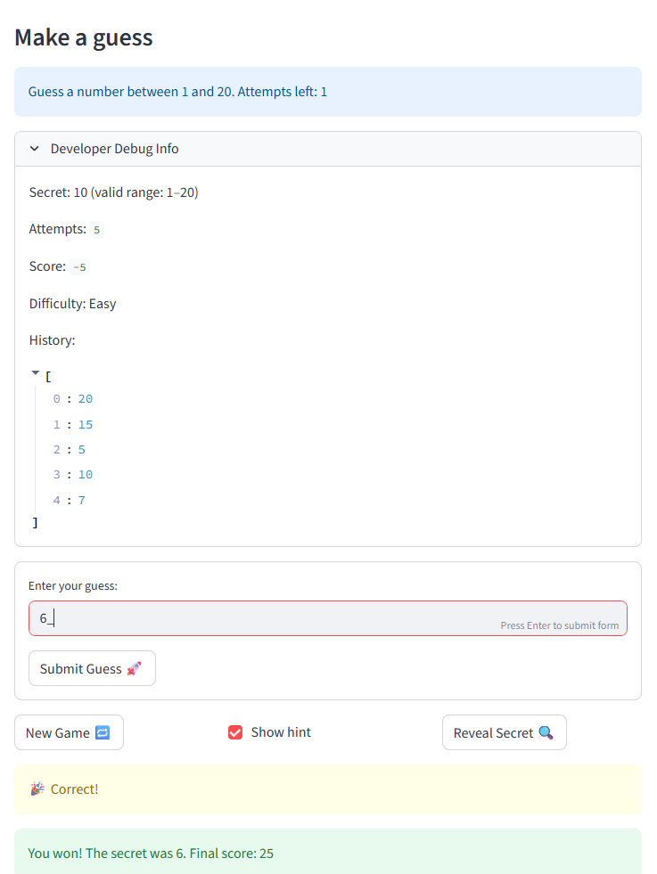
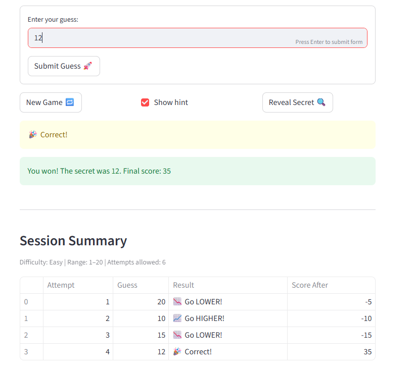

# 🎮 Game Glitch Investigator: The Impossible Guesser

## 🚨 The Situation

You asked an AI to build a simple "Number Guessing Game" using Streamlit.
It wrote the code, ran away, and now the game is unplayable. 

- You can't win.
- The hints lie to you.
- The secret number seems to have commitment issues.

## 🛠️ Setup

1. Install dependencies: `pip install -r requirements.txt`
2. Run the broken app: `python -m streamlit run app.py`

## 🕵️‍♂️ Your Mission

1. **Play the game.** Open the "Developer Debug Info" tab in the app to see the secret number. Try to win.
2. **Find the State Bug.** Why does the secret number change every time you click "Submit"? Ask ChatGPT: *"How do I keep a variable from resetting in Streamlit when I click a button?"*
3. **Fix the Logic.** The hints ("Higher/Lower") are wrong. Fix them.
4. **Refactor & Test.** - Move the logic into `logic_utils.py`.
   - Run `pytest` in your terminal.
   - Keep fixing until all tests pass!

## 📝 Document Your Experience

- [ ] Describe the game's purpose.
the game's purpose is to make the user guess a random number between 1-20 for easy, 1-50 for medium, and 1-100 for hard levels
- [ ] Detail which bugs you found.
I found bugs when clicking ente button, the difficulty of each level and Secret on Developer Debug Tools 
- [ ] Explain what fixes you applied.
I applied changes in clicking the button, difficulty, for each level to only have a right number between the range, for developer debug info to not state the right number but a random number to always be ±1–5 away from the real number, never the real number itself
## 📸 Demo

- 

## 🚀 Stretch Features

- 
